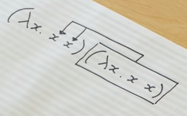

## Lambda Calculus

>https://www.youtube.com/watch?v=eis11j_iGMs

	λx.x+1

mean a box,input x,output x+1

	λx.λy.x+y

mean a box, input x,y, output x+y

	(λx.x+1) 5

= 5 + 1 = 6

true function and false function:

	TRUE = λx.λy.x

takes two things,and choose the first one.

	FALSE = λx.λy.y

takes two things,and choose the second one.

	NOT = λb. b FALSE TRUE

takes boolem, 

	AND = λb1.λb2. b1 b2 FALSE

	OR  = λb1.λb2. b1 TRUE b2

Y combinator/Y operator

	Y = λf.(λx.f(xx))(λx.f(xx))

this is the key to doing recursion in the Lambda Calculus.
invented by someone called Haskell Curry.

>https://www.youtube.com/watch?v=9T8A89jgeTI

	loop = (λx.xx)(λx.xx)

(λx.xx) input (λx.xx)

	rec f = f(rec f)

two challenging:

	loop = rec(?)

	fac = rec(λf.λn.?)

then let do it:

	loop = rec(λx.x) 
	loop = (λx.x)(rec (λx.x))
	loop = (λx.x)((λx.x)(rec (λx.x)))
<!---
	fac = rec(λf.λn.f(fac))
-->

What is a Monad? - Computerphile
>https://www.youtube.com/watch?v=t1e8gqXLbsU

   

