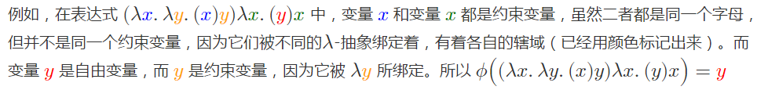

## Lambda Calculus

<!---
	丘奇 居然是 阿兰图灵的 博士生导师，这真是才知道-->

>https://www.youtube.com/watch?v=eis11j_iGMs  

	λx.x+1

mean a blackbox,input x,output x+1

	λx.λy.x+y

mean a box, input x,y, output x+y

	(λx.x+1) 5

= 5 + 1 = 6

## Define Logical notation

true function and false function:

	TRUE = λx.λy.x

takes two things,and choose the first one.

	FALSE = λx.λy.y

takes two things,and choose the second one.

	NOT = λb. b FALSE TRUE

takes boolem, 

	AND = λb1.λb2. b1 b2 FALSE

	OR  = λb1.λb2. b1 TRUE b2

原始的Lambda演算甚至连逻辑(true,false,not,and,or)和算术运算(+,-*,/)和数字都没有，所有的一切都是可以用Lambda演算定义出来的.

>https://www.youtube.com/watch?v=9T8A89jgeTI

	fac 3 = 3*2*1
	fac 3 = 3*(fac 2)

let show one easy recursion:

	loop = (λx.xx)(λx.xx)

(λx.xx) input (λx.xx)

then let see a one recursion:

	rec f = f(rec f)
		  = f(f(rec f))

two challenging:

	loop = rec (?)

	fac = rec (λf.λn.?)

then let do first challenging:

	loop = rec (λx.x) 
	loop = (λx.x)(rec (λx.x))

(λx.x) input (rec (λx.x))

	loop = rec (λx.x)

well done!

<!---
then let do second challenging:

	fac = rec (λf.λn.n*f(n-1))
	fac = (λf.λn.n*f(n-1))(rec (λf.λn.n*f(n-1)))

	fac 3 = 3*(fac 2)
-->

康托尔、哥德尔、图灵——永恒的金色对角线(rev#2)
>http://blog.csdn.net/pongba/article/details/1336028
<!---
	绕来绕去，都看晕了-->

The Y Combinator ［译］/ [原]
>http://superhex.github.io/2014/09/12/Y-Combinator/
>https://medium.com/@ayanonagon/the-y-combinator-no-not-that-one-7268d8d9c46
<!---
	看了这篇文章，好像终于看懂了，小姐姐很强啊-->

## 不动点

	X = (λx.f(x x))(λx.f(x x))
	X = f(x x) [x := λx.f(x x)]		// 符号”:=”代表”等于”的意思
	X = f((λx.f(x x))(λx.f(x x)))
	X = f X

可以看到对于任意给定的函数f,输入X输出还是X，X是f的不动点。
这样就可以构造一个函数，其参数input是f，其output是f的不动点

	Y = λf.(λx.f(x x))(λx.f(x x))

这就是 

## Y combinator/Y operator

还有其他方式推导Y的：
>https://zh.wikipedia.org/wiki/%E4%B8%8D%E5%8A%A8%E7%82%B9%E7%BB%84%E5%90%88%E5%AD%90

this is the key to doing recursion in the Lambda Calculus.
invented by someone called Haskell Curry.

不动点组合子的存在性意味着“所有函数都至少有一个不动点”，函数可以有多于一个不同的不动点。

我们来开始实现recursion吧

	F:= λf.λX.(if x == 0 then 1 else x*f(x-1)) 

	YF = F(YF)

	YF 3
	F(YF) 3
	λf.λX.(if x == 0 then 1 else x*f(x-1)) (YF) 3
	λX.(if x == 0 then 1 else x*(YF)(x-1)) 3
	if 3 == 0 then 1 else 3*(YF)(3-1)
	3 (YF) 2
	......
	6(YF)0
	6F(YF)0
	6(λf.λX.(if x == 0 then 1 else x*f(x-1)) (YF) 0)
	6(if 0 == 0 then 1 else 3*(YF)(0-1))
	6 1
    6

it's work! so the recursion n! is:
	 
	F-rec:= YF
	F-rec:= (λf.(λx.f(x x))(λx.f(x x)))(λf.λX.(if x == 0 then 1 else x*f(x-1)))

## 自由变量(Free Variable)，约束变量/绑定变量(Bounded Variable)

魂断不动点——Y组合子的前世今生
>http://deathking.github.io/2015/03/21/all-about-y-combinator/

<!---
	这篇文章中间部分把 自由变量，约束变量 讲解的很清楚。
	但是接下来就讲解了一堆 B,C,K,W什么的组合子，一堆数学推理和公式-->

自由变量好比习见程序设计语言中的全局变量，而绑定变量则像函数的形式参数。在程序设计语言中，通常提倡尽量少用甚至不用全局变量，都是为了规避不可控的上下文对局部过程的影响。

## Monad

What is a Monad? - Computerphile
>https://www.youtube.com/watch?v=t1e8gqXLbsU

图文解说版 [原] /［译］
>http://adit.io/posts/2013-04-17-functors,_applicatives,_and_monads_in_pictures.html
>http://jiyinyiyong.github.io/monads-in-pictures/
   

两篇paper：
先看Philip Wadler的Monads for functional programming，
然后看他的The essence of functional programming，后者提到了Monad和CPS之间的关系。
然后你还得写。。写几个用Monad的parser/interpreter就熟悉了。

<!--- 看不懂monad啊，paper也 全是 英文的。-->

